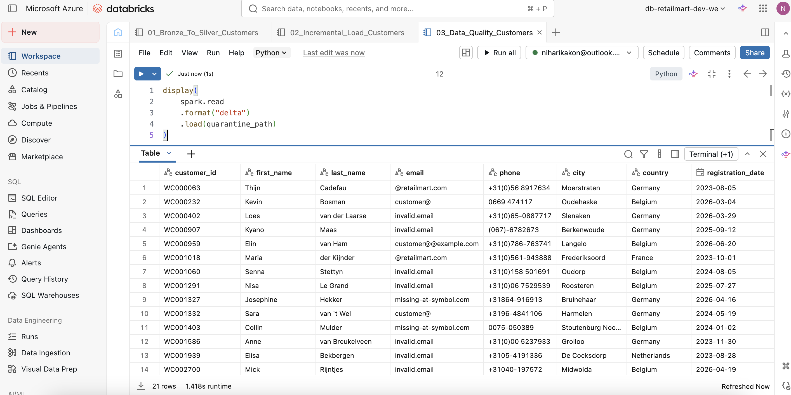
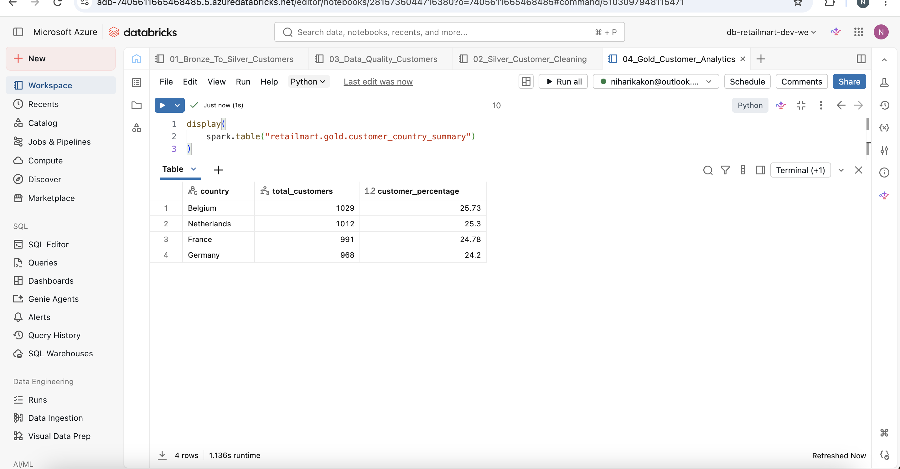
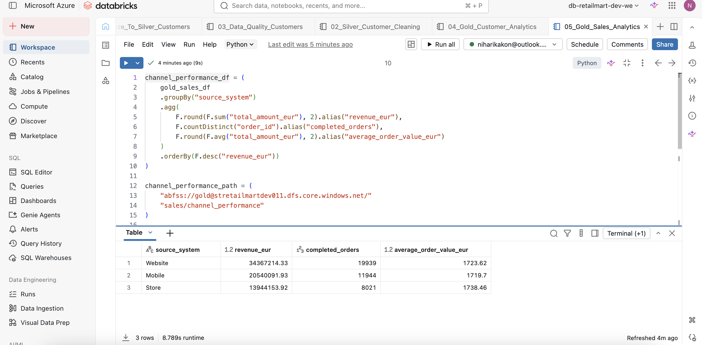
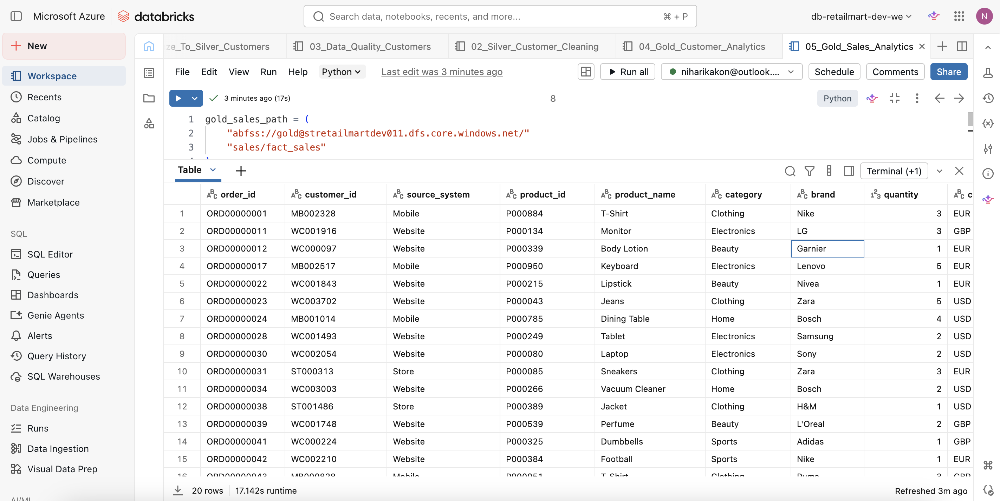
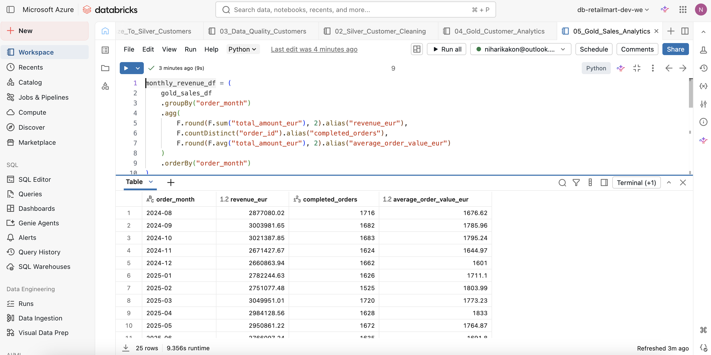
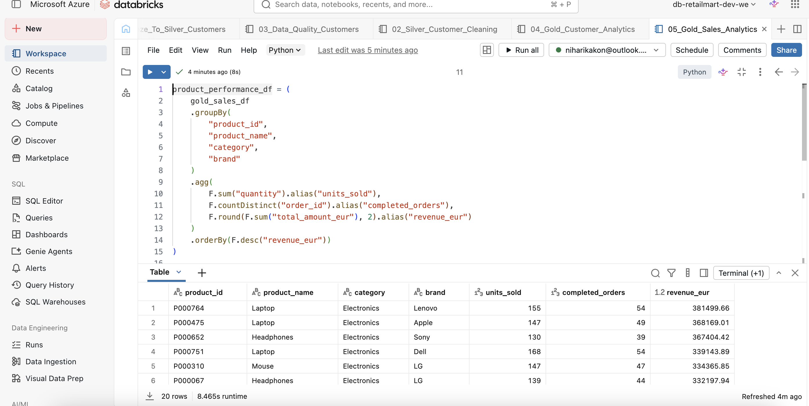

# Enterprise Data Platform – Azure Lakehouse


## Project Overview

This project demonstrates the design and implementation of an enterprise-style retail data platform using Microsoft Azure.

The platform ingests data from multiple operational source systems using Azure Data Factory, stores raw files in Azure Data Lake Storage Gen2, transforms the data using Azure Databricks and PySpark, and produces business-ready Delta tables using the Medallion Architecture.

The project includes:

- Reusable and parameterized Azure Data Factory ingestion
- Bronze, Silver and Gold data layers
- PySpark transformations
- Delta Lake tables
- Data-quality validation
- Invalid-record quarantine handling
- Incremental loading using Delta Lake `MERGE`
- Currency conversion into EUR
- Unity Catalog governance
- Customer and sales analytics datasets

Power BI and CI/CD are tracked as future enhancements.

---

## Business Problem

RetailMart receives data from several independent operational systems:

- Website
- Mobile application
- CRM
- Physical stores
- Product catalogue
- Order-processing platform
- Payment platform
- Exchange-rate reference system

These systems use different customer identifiers, schemas, data formats and currencies.

Without a central data platform, the business faces challenges such as:

- Duplicate customer records
- Invalid and missing customer information
- Inconsistent data formats
- Multiple transaction currencies
- Limited visibility across sales channels
- Delayed reporting
- Difficult cross-system analytics
- No centralized record of rejected data

The objective of this project is to consolidate these sources into a governed Azure Lakehouse that supports reliable analytics and future reporting.

---

## Project Goals

- Generate realistic and connected retail datasets
- Build a reusable ingestion framework with Azure Data Factory
- Store raw source data in ADLS Gen2
- Implement the Medallion Architecture
- Clean and standardize data using PySpark
- Use Delta Lake for reliable Silver and Gold storage
- Introduce data-quality checks and quarantine handling
- Implement incremental updates using Delta Lake `MERGE`
- Convert sales values into a common EUR reporting currency
- Build analytics-ready customer and sales datasets
- Use managed identities instead of embedded storage credentials
- Document the solution for portfolio and interview use

---

## Solution Architecture

```text
Python Data Generators
        |
        v
ADLS Gen2 Source Container
        |
        v
Azure Data Factory
Reusable Parameterized Pipeline
        |
        v
ADLS Gen2 Bronze Layer
Raw CSV Files
        |
        v
Azure Databricks
PySpark Transformations
        |
        +----------------------+
        |                      |
        v                      v
ADLS Gen2 Silver         Quarantine Layer
Clean Delta Tables       Invalid Records
        |
        v
ADLS Gen2 Gold Layer
Business-Ready Delta Tables
        |
        v
Analytics Consumers
Power BI planned as a future enhancement
```

---

## Medallion Architecture

### Source Layer

The Source container simulates files delivered by operational source systems.

### Bronze Layer

The Bronze layer stores data exactly as received.

It provides:

- Raw source-file preservation
- Auditability
- Reprocessing capability
- Troubleshooting support
- Separation between ingestion and transformation

### Silver Layer

The Silver layer contains cleaned and standardized Delta datasets.

Transformations include:

- Duplicate removal
- Customer-ID validation
- Email-format validation
- Email lowercasing
- Name and city standardization
- Phone-number normalization
- Date conversion
- Audit timestamp creation
- Invalid-record separation
- Delta Lake incremental updates

### Gold Layer

The Gold layer contains analytics-ready datasets.

Gold tables support:

- Customer distribution analysis
- Completed sales reporting
- Monthly revenue trends
- Channel performance
- Product performance
- EUR-based financial reporting

### Quarantine Layer

The Quarantine layer stores invalid records separately instead of deleting them.

Each rejected record includes:

- Rejection reason
- Source system
- Quarantine timestamp
- Original source attributes

---

## Technology Stack

| Area | Technology |
|---|---|
| Cloud platform | Microsoft Azure |
| Data ingestion | Azure Data Factory |
| Orchestration | Azure Data Factory |
| Data lake | Azure Data Lake Storage Gen2 |
| Data processing | Azure Databricks |
| Distributed processing | Apache Spark and PySpark |
| Transactional storage | Delta Lake |
| Data governance | Unity Catalog |
| Authentication | Managed Identity and Databricks Access Connector |
| Data generation | Python, Pandas and Faker |
| Querying | Spark SQL and SQL |
| Version control | Git and GitHub |
| Reporting | Power BI — future enhancement |
| CI/CD | Future enhancement |

---

## Project Statistics

| Metric | Value |
|---|---:|
| Source domains | 8 |
| Master customers | 5,000 |
| Website customer rows | Approximately 4,020 |
| Mobile customer rows | Approximately 3,515 |
| CRM customer rows | Approximately 2,810 |
| Store customer rows | Approximately 2,010 |
| Products | 1,000 |
| Orders | 50,000 |
| Payments | 50,000 |
| Exchange-rate records | 731 |
| Generated records | More than 115,000 |
| ADF reusable pipelines | 1 |
| Core Databricks notebooks | 6 |
| Main Gold tables | 5 |
| Architecture pattern | Medallion Architecture |

---

## Data Sources

### Master Customers

A controlled master customer dataset used to create overlapping customer records across different systems.

### Website Customers

Website customer accounts containing intentional data-quality problems.

Examples include:

- Invalid email formats
- Duplicate customer IDs
- Missing attributes
- Inconsistent casing
- Extra whitespace

### Mobile Customers

Mobile-application customers using a source-specific schema and identifiers.

### CRM Customers

Customer relationship and marketing data with different customer attributes and identifiers.

### Store Customers

Physical-store customer records with limited attributes and store-specific identifiers.

### Products

A product catalogue containing:

- Product ID
- Product name
- Category
- Brand
- Price
- Currency
- Active status

### Orders

Orders from Website, Mobile and Store channels.

Order data includes:

- Customer
- Product
- Quantity
- Currency
- Discounts
- Tax
- Total amount
- Status
- Order date

### Payments

Payment records containing:

- Successful payments
- Failed payments
- Pending payments
- Refunds
- Payments not attempted
- Late-arriving payments

### Exchange Rates

Daily EUR, USD and GBP exchange-rate data used to standardize revenue reporting into EUR.

---

## Repository Structure

```text
enterprise-data-platform-azure-lakehouse/
│
├── README.md
├── .gitignore
│
├── adf/
│
├── architecture/
│
├── data_generator/
│   ├── generate_master_customers.ipynb
│   ├── generate_source_systems.ipynb
│   ├── generate_products.ipynb
│   ├── generate_orders.pipynb
│   ├── generate_payments.ipynb
│   ├── generate_exchange_rates.ipynb
│   └── utils/
│
├── datasets/
│   ├── master/
│   ├── website/
│   ├── mobile/
│   ├── crm/
│   ├── store/
│   ├── products/
│   ├── orders/
│   ├── payments/
│   └── reference/
│
├── databricks/
│   ├── 01_bronze_to_silver_customers.py
│   ├── 02_incremental_load_customers.py
│   ├── 03_data_quality_customers.py
│   ├── 04_silver_customer_cleaning.py
│   ├── 05_gold_customer_analytics.py
│   └── 06_gold_sales_analytics.py
│
├── documentation/
│   ├── architecture.md
│   └── pipeline.md
│
├── images/
│   ├── adf/
│   ├── azure/
│   ├── databricks/
│   ├── architecture/
│   └── powerbi/
│
├── powerbi/
│
└── sql/
```

---

## Azure Data Lake Structure

```text
source/
├── website/
├── mobile/
├── crm/
├── store/
├── products/
├── orders/
├── payments/
└── reference/
```

```text
bronze/
├── website/
├── mobile/
├── crm/
├── store/
├── products/
├── orders/
├── payments/
└── reference/
```

```text
silver/
├── website/
└── catalog/
```

```text
gold/
├── customer_country_summary/
└── sales/
    ├── fact_sales/
    ├── monthly_revenue/
    ├── channel_performance/
    └── product_performance/
```

```text
quarantine/
└── customers/
    └── website_invalid_emails/
```

---

## Azure Data Factory Ingestion

The ingestion layer uses one reusable pipeline:

```text
pl_ingest_file
```

Instead of creating a separate pipeline for every dataset, the pipeline accepts dynamic parameters.

### Pipeline Parameters

| Parameter | Description |
|---|---|
| `sourceContainer` | ADLS input container |
| `sourceFolder` | Folder containing the source file |
| `sourceFile` | Name of the input file |
| `sinkContainer` | ADLS destination container |
| `sinkFolder` | Destination folder in Bronze |

### Example Execution

```text
sourceContainer = source
sourceFolder    = products
sourceFile      = products.csv
sinkContainer   = bronze
sinkFolder      = products
```

The same pipeline is reused for:

- Website customers
- Mobile customers
- CRM customers
- Store customers
- Products
- Orders
- Payments
- Exchange rates

### Benefits

- Reduced pipeline duplication
- Easier maintenance
- Reusable ingestion pattern
- Consistent naming and structure
- Easier onboarding of new files
- Better scalability than one pipeline per dataset

---

## Secure Storage Access

Storage access is implemented without hardcoded storage keys.

The solution uses:

```text
Databricks Access Connector
        |
        v
System-Assigned Managed Identity
        |
        v
Storage Blob Data Contributor
        |
        v
Unity Catalog Storage Credential
        |
        v
External Locations
```

External locations were created for:

- Bronze
- Silver
- Gold
- Quarantine

This design provides governed access to ADLS Gen2 through Unity Catalog.

---

## Databricks Notebooks

| Notebook | Purpose |
|---|---|
| `01_bronze_to_silver_customers.py` | Initial Bronze-to-Silver customer transformation |
| `02_incremental_load_customers.py` | Delta Lake incremental customer upsert |
| `03_data_quality_customers.py` | Data-quality checks and quarantine processing |
| `04_silver_customer_cleaning.py` | Customer standardization and clean Delta output |
| `05_gold_customer_analytics.py` | Customer-focused Gold aggregations |
| `06_gold_sales_analytics.py` | Sales, revenue, channel and product Gold datasets |

---

## Bronze-to-Silver Customer Processing

The customer transformation performs the following steps:

1. Read the raw Bronze CSV file.
2. Inspect the schema and record count.
3. Validate customer IDs.
4. Validate email formats.
5. Trim leading and trailing spaces.
6. Convert emails to lowercase.
7. Standardize first and last names.
8. Normalize phone numbers.
9. Standardize city and country values.
10. Convert registration dates.
11. Add source-system information.
12. Add audit timestamps.
13. Remove exact duplicates.
14. Keep one record per business customer key.
15. Separate valid and rejected records.
16. Write valid records to Silver.
17. Write rejected records to Quarantine.

---

## Data-Quality Framework

The project performs checks for:

- Missing customer IDs
- Invalid customer-ID format
- Duplicate customer IDs
- Missing first names
- Missing last names
- Invalid email formats
- Inconsistent casing
- Extra whitespace
- Invalid date formats
- Record-count reconciliation

### Invalid Record Examples

Examples intentionally included in the source data:

```text
invalid.email
customer@
@retailmart.com
customer@@example.com
missing-at-symbol.com
```

### Quarantine Pattern

```text
Bronze Customer Data
        |
        v
Data-Quality Checks
        |
        +---------------------+
        |                     |
        v                     v
Valid Records           Invalid Records
        |                     |
        v                     v
Silver Delta            Quarantine Delta
```

Invalid records contain the following audit fields:

```text
rejection_reason
source_system
quarantined_at
```

### Reconciliation

The workflow verifies:

```text
Valid Records + Invalid Records = Total Bronze Records
```

This ensures that no records are silently lost.

---

## Incremental Loading

The project uses Delta Lake `MERGE` to process customer updates incrementally.

### Incremental Logic

```text
IF customer_id exists
    UPDATE the existing record
ELSE
    INSERT a new record
```

### Benefits

- Avoids full-table reloads
- Supports updates and inserts
- Prevents duplicate business keys
- Reduces unnecessary processing
- Supports scalable daily ingestion

### Example

A customer city can be updated without duplicating the customer record:

```text
Before:
WC000001 | Achtmaal

After incremental MERGE:
WC000001 | Amsterdam
```

---

## Currency Conversion

Orders are generated in:

- EUR
- USD
- GBP

The exchange-rate reference dataset is transformed from wide format into a reusable long format.

```text
exchange_date | currency | rate_to_currency
```

Orders are joined to exchange rates using:

- Order date
- Transaction currency

Revenue is then converted into EUR.

```text
EUR order:
total_amount_eur = total_amount

USD or GBP order:
total_amount_eur = total_amount / exchange_rate
```

The pipeline verifies that no orders are missing exchange rates before Gold tables are created.

---

## Gold Analytics Tables

### `retailmart.gold.customer_country_summary`

Contains:

- Country
- Total customers
- Customer percentage

Purpose:

- Customer-distribution reporting
- Geographic analysis
- Future customer dashboard

---

### `retailmart.gold.fact_sales`

Contains completed sales enriched with product and currency information.

Important columns include:

- Order ID
- Customer ID
- Source system
- Product ID
- Product name
- Category
- Brand
- Quantity
- Original currency
- Original amount
- EUR amount
- Order date
- Order year
- Order month
- Gold creation timestamp

Only completed orders are included as positive sales.

---

### `retailmart.gold.monthly_revenue`

Contains:

- Order month
- Revenue in EUR
- Completed-order count
- Average order value in EUR

Purpose:

- Monthly trend reporting
- Revenue analysis
- Order-volume analysis

---

### `retailmart.gold.channel_performance`

Contains performance for:

- Website
- Mobile
- Store

Metrics include:

- Revenue in EUR
- Completed orders
- Average order value

Purpose:

- Compare sales channels
- Identify the strongest-performing channel
- Support channel-investment decisions

---

### `retailmart.gold.product_performance`

Contains:

- Product ID
- Product name
- Category
- Brand
- Units sold
- Completed orders
- Revenue in EUR

Purpose:

- Product-ranking analysis
- Category analysis
- Brand performance
- Top-product reporting

---

## Screenshots

> Update the filenames below if your local screenshot names are different.

### Generic ADF Pipeline


### Successful ADF Execution


### Complete Bronze Structure


### Bronze Data Loaded in Databricks


### Silver Cleaned Data


### Silver Delta Table


### Quarantine Records



### Gold Customer Summary



### Gold Sales Fact



### Monthly Revenue



### Channel Performance



### Product Performance



---

## Key Engineering Decisions

### Why Azure Data Factory and Databricks?

Azure Data Factory is used for:

- Data ingestion
- File movement
- Parameterized pipelines
- Orchestration

Azure Databricks is used for:

- Data cleaning
- Distributed transformation
- Delta Lake processing
- Incremental updates
- Data-quality checks
- Business aggregations

This separates orchestration from compute-intensive transformation.

### Why Bronze, Silver and Gold?

- Bronze preserves raw source data.
- Silver provides trusted and standardized data.
- Gold provides business-ready analytics datasets.

### Why Delta Lake?

Delta Lake provides:

- ACID transactions
- Schema enforcement
- Schema evolution
- Reliable updates
- `MERGE` support
- Better consistency than plain CSV or Parquet files

### Why Quarantine Instead of Deleting Records?

Invalid records may still be required for:

- Auditing
- Troubleshooting
- Business review
- Source-system correction
- Reprocessing

Quarantining maintains traceability and prevents silent data loss.

### Why Managed Identity?

Managed identity avoids storing:

- Account keys
- Passwords
- SAS tokens
- Client secrets

This provides a more secure and production-aligned access pattern.

---

## Challenges Solved

### ADF Storage Authorization

The ADF managed identity initially lacked access to ADLS.

Resolution:

- Assigned the `Storage Blob Data Contributor` role
- Published the linked service
- Verified the connection

### Dynamic Dataset Schemas

The reusable ADF pipeline initially contained a fixed customer schema, which prevented product files from being copied correctly.

Resolution:

- Cleared fixed schemas
- Removed static mappings
- Used runtime CSV headers and dynamic paths

### Databricks Regional Quota

The original Databricks region did not have sufficient compute quota.

Resolution:

- Created the workspace in Sweden Central
- Used single-node compute
- Enabled auto-termination to control costs

### Unity Catalog Storage Access

Direct ADLS access initially failed because Databricks did not have governed access to each container.

Resolution:

- Created a Databricks Access Connector
- Assigned storage permissions
- Created a Unity Catalog storage credential
- Created external locations for Bronze, Silver, Gold and Quarantine

### Incorrect Source Format

Some Bronze files were initially read as Delta or Parquet even though they were CSV files.

Resolution:

- Read Bronze files using the CSV reader
- Wrote Silver and Gold outputs in Delta format

### Missing Notebook Variables

Databricks variables were lost when notebook sessions or clusters restarted.

Resolution:

- Re-ran prerequisite cells in order
- Grouped essential setup logic into reproducible notebook cells

---

## Current Project Status

- [x] Generate connected retail datasets
- [x] Create ADLS Gen2 containers
- [x] Configure Azure Data Factory linked service
- [x] Assign managed-identity permissions
- [x] Build a reusable parameterized ingestion pipeline
- [x] Load all source datasets into Bronze
- [x] Create Azure Databricks workspace
- [x] Configure Databricks Access Connector
- [x] Configure Unity Catalog storage credential
- [x] Create Bronze, Silver, Gold and Quarantine external locations
- [x] Build Bronze-to-Silver customer transformations
- [x] Implement data-quality checks
- [x] Implement invalid-record Quarantine processing
- [x] Add record-count reconciliation
- [x] Write Silver Delta tables
- [x] Register Silver tables in Unity Catalog
- [x] Implement Delta Lake incremental `MERGE`
- [x] Build customer Gold analytics
- [x] Build sales fact table
- [x] Build monthly revenue table
- [x] Build channel-performance table
- [x] Build product-performance table
- [x] Document the architecture and pipeline
- [ ] Build Power BI dashboards
- [ ] Add CI/CD automation
- [ ] Add automated pipeline scheduling
- [ ] Add production monitoring and alerting

> Power BI and CI/CD are intentionally tracked as future enhancements. The current release focuses on the Azure Lakehouse ingestion, transformation, quality, governance and analytics layers.

---

## Future Improvements

- Build Power BI dashboards
- Add Azure Data Factory triggers
- Add Databricks Workflows
- Parameterize Databricks notebooks
- Add end-to-end orchestration
- Implement SCD Type 2 customer history
- Add partitioning for large Gold datasets
- Add Spark performance optimization
- Add automated unit tests
- Add data-quality expectation frameworks
- Add Azure Monitor and Log Analytics
- Add failure notifications
- Add CI/CD using GitHub Actions or Azure DevOps
- Create Dev, Test and Production environments
- Store configuration in metadata tables
- Add incremental file-watermark processing
- Add Auto Loader for scalable file ingestion
- Add Event Grid file notifications
- Add role-based Unity Catalog access
- Add Power BI incremental refresh

---

## Interview Explanation

A concise explanation of the project:

> I built an Azure Lakehouse for a simulated retail company using Azure Data Factory, ADLS Gen2, Azure Databricks, PySpark, Delta Lake and Unity Catalog. I generated connected customer, product, order, payment and exchange-rate datasets, then created a reusable parameterized ADF pipeline to ingest all source files into the Bronze layer. In Databricks, I implemented customer cleaning, data-quality checks, invalid-record quarantine handling and incremental Delta Lake MERGE logic. I then built Gold customer and sales tables, including EUR revenue conversion, monthly revenue, channel performance and product performance. Storage access is secured using managed identities, a Databricks Access Connector and Unity Catalog external locations.

---

## Key Interview Topics Demonstrated

- Azure Data Factory
- Parameterized pipelines
- ADLS Gen2
- Medallion Architecture
- Azure Databricks
- PySpark DataFrames
- Delta Lake
- Incremental loading
- Delta Lake `MERGE`
- Data-quality validation
- Quarantine design
- Currency conversion
- Unity Catalog
- Managed identities
- Gold fact and aggregate tables
- Customer analytics
- Sales analytics
- Auditability and reconciliation
- Secure cloud-storage access

---

## Author

**Niharika Reddy**

Azure Data Engineer portfolio project focused on enterprise ingestion, transformation, data quality, governance and analytics patterns.

---

## Disclaimer

All customer, product, order and payment data in this repository is synthetically generated for educational and portfolio purposes. It does not contain real customer or company data.